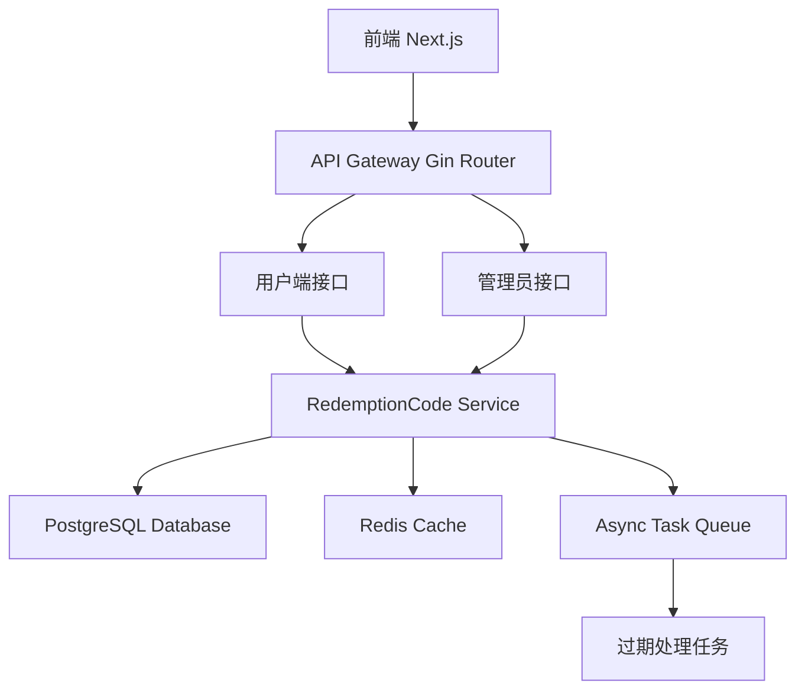
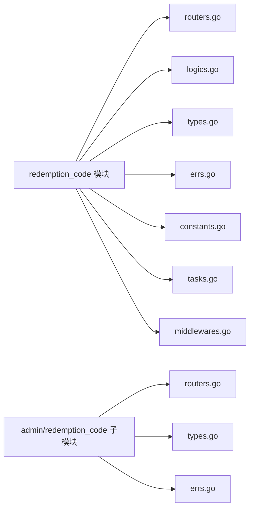
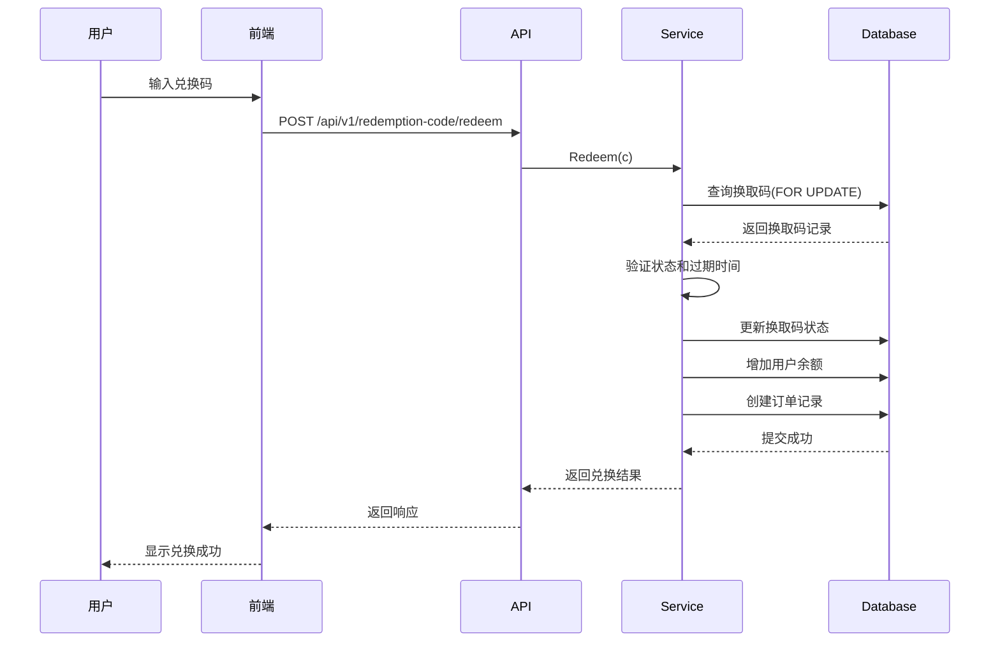

# 积分换取码功能技术设计文档

Feature Name: point-redemption-code
Updated: 2026-03-20

## 描述

积分换取码功能允许管理员批量生成可兑换积分的兑换码，用户可以通过输入兑换码来获取积分。该功能采用与现有红包系统类似的架构，但增加了批次管理和更灵活的状态控制。

## 架构

### 系统架构图



### 模块架构图



### 兑换流程时序图



## 组件和接口

### 后端组件

#### 1. 用户端 Redemption Code 模块

**位置**: `internal/apps/redemption_code/`

**主要文件**:

- `routers.go` - 路由处理函数
- `logics.go` - 业务逻辑
- `types.go` - 请求/响应类型定义
- `errs.go` - 错误定义
- `constants.go` - 常量定义

**核心接口**:

```go
// Redeem 兑换积分
func Redeem(c *gin.Context)

// GetHistory 获取兑换历史
func GetHistory(c *gin.Context)
```

#### 2. 管理员 Redemption Code 模块

**位置**: `internal/apps/admin/redemption_code/`

**主要文件**:

- `routers.go` - 路由处理函数
- `types.go` - 请求/响应类型定义
- `errs.go` - 错误定义

**核心接口**:

```go
// Create 创建换取码（支持批量）
// 支持两种模式：
// 1. 统一模式：所有码使用相同的金额和过期时间
// 2. 灵活模式：通过上传CSV文件指定每个码的金额和过期时间
func Create(c *gin.Context)

// List 获取换取码列表
func List(c *gin.Context)

// UpdateStatus 更新换取码状态
func UpdateStatus(c *gin.Context)

// Delete 删除换取码
func Delete(c *gin.Context)

// Export 导出批次换取码为CSV文件
func Export(c *gin.Context)

// ListBatches 获取批次列表
func ListBatches(c *gin.Context)

// GetBatchDetail 获取批次详情
func GetBatchDetail(c *gin.Context)
```

#### 3. 数据模型

**位置**: `internal/model/redemption_code.go`

```go
// RedemptionCode 换取码模型
type RedemptionCode struct {
    ID         uint64                `json:"id" gorm:"primaryKey"`
    Code       string                `json:"code" gorm:"size:32;uniqueIndex;not null"`
    BatchID    uint64                `json:"batch_id" gorm:"index;not null"`
    Amount     decimal.Decimal       `json:"amount" gorm:"type:numeric(20,2);not null"`
    Status     RedemptionCodeStatus  `json:"status" gorm:"type:varchar(20);default:'unused';index"`
    UsedBy     *uint64               `json:"used_by" gorm:"index"`
    UsedAt     *time.Time            `json:"used_at"`
    CreatedBy  uint64                `json:"created_by" gorm:"not null"`
    ExpiresAt  time.Time             `json:"expires_at" gorm:"index;not null"`
    CreatedAt  time.Time             `json:"created_at" gorm:"autoCreateTime"`
    UpdatedAt  time.Time             `json:"updated_at" gorm:"autoUpdateTime"`
    DeletedAt  gorm.DeletedAt        `json:"deleted_at" gorm:"index"`
    
    // 关联字段（非持久化）
    Username   string                `json:"username" gorm:"-"`
    AvatarURL  string                `json:"avatar_url" gorm:"-"`
}

// RedemptionBatch 批次模型
type RedemptionBatch struct {
    ID           uint64          `json:"id" gorm:"primaryKey"`
    Name         string          `json:"name" gorm:"size:100;not null"`
    Description  string          `json:"description" gorm:"type:text"`
    TotalCount   int             `json:"total_count" gorm:"not null"`
    UsedCount    int             `json:"used_count" gorm:"default:0"`
    TotalAmount  decimal.Decimal `json:"total_amount" gorm:"type:numeric(20,2);not null"`
    CreatedBy    uint64          `json:"created_by" gorm:"not null"`
    CreatedAt    time.Time       `json:"created_at" gorm:"autoCreateTime"`
}

// RedemptionCodeStatus 换取码状态
type RedemptionCodeStatus string

const (
    RedemptionCodeStatusUnused   RedemptionCodeStatus = "unused"
    RedemptionCodeStatusUsed     RedemptionCodeStatus = "used"
    RedemptionCodeStatusExpired  RedemptionCodeStatus = "expired"
    RedemptionCodeStatusDisabled RedemptionCodeStatus = "disabled"
)
```

### 前端组件

#### 1. 用户端页面

**位置**: `frontend/app/(app)/redemption-code/`

**页面结构**:

- `page.tsx` - 兑换页面（输入兑换码）
- `history/page.tsx` - 兑换历史页面

#### 2. 管理员页面

**位置**: `frontend/app/(admin)/admin/redemption-code/`

**页面结构**:

- `page.tsx` - 换取码列表页面
- `create/page.tsx` - 创建换取码页面
- `batch/page.tsx` - 批次列表页面
- `batch/[id]/page.tsx` - 批次详情页面

#### 3. 前端服务层

**位置**: `frontend/lib/services/redemption-code/`

**文件结构**:

- `redemption-code.service.ts` - API 调用封装
- `types.ts` - TypeScript 类型定义
- `index.ts` - 导出

**核心服务方法**:

```typescript
class RedemptionCodeService {
    // 用户端
    async redeem(code: string): Promise<RedeemResponse>
    async getHistory(page: number, pageSize: number): Promise<HistoryResponse>
    
    // 管理员端
    async createBatch(data: CreateBatchRequest): Promise<CreateBatchResponse>
    async listCodes(params: ListCodesParams): Promise<ListCodesResponse>
    async updateStatus(id: string, status: string): Promise<void>
    async deleteCode(id: string): Promise<void>
    async listBatches(params: ListBatchesParams): Promise<ListBatchesResponse>
    async getBatchDetail(id: string): Promise<BatchDetailResponse>
}
```

## 数据模型

### 数据库表结构

#### redemption_codes 表

```sql
CREATE TABLE redemption_codes (
    id BIGINT PRIMARY KEY,
    code VARCHAR(32) UNIQUE NOT NULL,
    batch_id BIGINT NOT NULL,
    amount NUMERIC(20,2) NOT NULL,
    status VARCHAR(20) DEFAULT 'unused',
    used_by BIGINT,
    used_at TIMESTAMP,
    created_by BIGINT NOT NULL,
    expires_at TIMESTAMP NOT NULL,
    created_at TIMESTAMP DEFAULT CURRENT_TIMESTAMP,
    updated_at TIMESTAMP DEFAULT CURRENT_TIMESTAMP,
    deleted_at TIMESTAMP,
    
    INDEX idx_batch_id (batch_id),
    INDEX idx_status (status),
    INDEX idx_used_by (used_by),
    INDEX idx_expires_at (expires_at),
    INDEX idx_deleted_at (deleted_at)
);
```

#### redemption_batches 表

```sql
CREATE TABLE redemption_batches (
    id BIGINT PRIMARY KEY,
    name VARCHAR(100) NOT NULL,
    description TEXT,
    total_count INT NOT NULL,
    used_count INT DEFAULT 0,
    total_amount NUMERIC(20,2) NOT NULL,
    created_by BIGINT NOT NULL,
    created_at TIMESTAMP DEFAULT CURRENT_TIMESTAMP
);
```

### Redis 缓存策略

#### 缓存键设计

- `redemption_code:{code}` - 单个换取码缓存（TTL: 1小时）
- `redemption_batch:{id}` - 批次详情缓存（TTL: 1小时）

#### 缓存更新策略

- 兑换成功后删除对应换取码的缓存
- 更新批次统计后删除批次缓存
- 使用 Cache-Aside 模式

## 正确性属性

### 数据一致性

1. **兑换操作的原子性**: 兑换过程必须在数据库事务中完成，包括：
   - 验证换取码状态
   - 更新换取码状态
   - 增加用户余额
   - 创建订单记录
   - 更新批次统计

2. **并发兑换保护**: 使用 `FOR UPDATE NOWAIT` 锁防止同一换取码被并发兑换

3. **余额更新**: 使用现有的 `service.UpdateBalance` 方法确保余额更新的一致性

### 业务规则

1. **换取码唯一性**: 每个换取码字符串全局唯一，使用唯一索引保证

2. **金额限制**: 
   - 单个换取码金额 > 0
   - 单个换取码金额 <= 系统配置的最大值
   - 批量创建总金额 <= 管理员权限限制

3. **状态转换规则**:
   - `unused` -> `used` (兑换成功)
   - `unused` -> `expired` (定时任务或用户尝试使用时)
   - `unused` -> `disabled` (管理员禁用)
   - `disabled` -> `unused` (管理员启用)
   - `used` 状态不可逆
   - `expired` 状态不可逆

4. **过期时间**: 过期时间必须大于创建时间

### 性能约束

1. **批量创建限制**: 单次最多创建 1000 个换取码
2. **查询分页**: 每页最多 100 条记录
3. **响应时间**: 兑换操作应在 500ms 内完成

## 错误处理

### 错误码定义

**位置**: `internal/apps/redemption_code/errs.go` 和 `internal/apps/admin/redemption_code/errs.go`

```go
// 用户端错误
const (
    ErrCodeNotFound      = "换取码不存在"
    ErrCodeAlreadyUsed   = "换取码已被使用"
    ErrCodeExpired       = "换取码已过期"
    ErrCodeDisabled      = "换取码无效"
    ErrInvalidCodeFormat = "兑换码格式错误"
)

// 管理员端错误
const (
    ErrAmountTooLarge     = "单个换取码金额超过限制"
    ErrBatchTooLarge      = "批量创建数量超过限制"
    ErrCannotDisableUsed  = "无法禁用已使用的换取码"
    ErrCannotDeleteUsed   = "无法删除已使用的换取码"
    ErrInvalidExpireTime  = "过期时间无效"
)
```

### 错误处理策略

1. **输入验证错误**: 返回 HTTP 400，提供详细的错误信息

2. **业务规则错误**: 返回 HTTP 400 或 HTTP 403，使用用户友好的错误提示

3. **资源未找到**: 返回 HTTP 404

4. **服务器内部错误**: 返回 HTTP 500，记录详细日志，返回通用错误提示

5. **并发冲突**: 返回 HTTP 409，提示用户稍后重试

### 日志记录

- 所有兑换操作记录 INFO 级别日志
- 错误情况记录 ERROR 级别日志
- 日志包含：用户ID、换取码ID、金额、操作结果

## 测试策略

### 单元测试

**测试范围**:

1. **换取码生成**: 验证生成的码符合格式要求，不重复
2. **状态验证**: 验证各种状态下的兑换行为
3. **金额计算**: 验证余额增加和统计更新的正确性
4. **过期检查**: 验证过期逻辑的正确性

**测试文件位置**: `internal/apps/redemption_code/*_test.go`

### 集成测试

**测试场景**:

1. **完整兑换流程**: 从创建换取码到用户兑换的端到端测试
2. **并发兑换**: 模拟多个用户同时兑换同一个码
3. **批量创建**: 测试批量创建的性能和正确性
4. **过期处理**: 测试定时任务的过期处理逻辑

**测试文件位置**: `internal/apps/redemption_code/integration_test.go`

### API 测试

**测试工具**: 使用 Swagger 进行 API 文档测试

**测试覆盖**:

- 所有接口的正常流程
- 各种错误情况的处理
- 权限验证

### 性能测试

**测试场景**:

1. **兑换并发**: 100 并发用户同时兑换不同的换取码
2. **批量创建**: 创建 1000 个换取码的响应时间
3. **列表查询**: 查询包含 10000 条记录的分页性能

**性能指标**:

- 兑换操作: P99 < 500ms
- 批量创建: P99 < 5s
- 列表查询: P99 < 200ms

## 安全考虑

### 权限控制

1. **管理员权限**: 所有管理员接口需要验证 `is_admin` 字段
2. **用户认证**: 所有用户接口需要验证 OAuth2 登录状态

### 数据安全

1. **换取码随机性**: 使用加密安全的随机数生成器生成换取码
2. **SQL 注入防护**: 使用 GORM 参数化查询
3. **XSS 防护**: 前端使用 React 自动转义

### 防滥用措施

1. **兑换频率限制**: 
   - 同一用户每分钟最多兑换 10 次
   - 使用 Redis 记录用户兑换次数：`redemption_rate_limit:{user_id}`
   - 超过限制返回 HTTP 429 错误
2. **批量创建限制**: 单次最多创建 1000 个码
3. **审计日志**: 记录所有创建和兑换操作

## 部署和迁移

### 数据库迁移

**迁移文件**: `migrations/YYYYMMDDHHMMSS_create_redemption_codes_table.sql`

```sql
-- 创建 redemption_codes 表
CREATE TABLE redemption_codes (
    -- ... 表结构 ...
);

-- 创建 redemption_batches 表
CREATE TABLE redemption_batches (
    -- ... 表结构 ...
);

-- 添加索引
CREATE INDEX idx_redemption_codes_batch_id ON redemption_codes(batch_id);
-- ... 其他索引 ...
```

### 配置项

**系统配置** (添加到 `system_configs` 表):

- `redemption_code_max_amount`: 单个换取码最大金额（默认: 10000）
- `redemption_code_max_batch_size`: 批量创建最大数量（默认: 1000）
- `redemption_code_default_expire_days`: 默认过期天数（默认: 365）

### 定时任务

**任务名称**: `ExpireRedemptionCodesTask`

**执行频率**: 每小时执行一次

**任务逻辑**:

```go
func ExpireRedemptionCodesTask(ctx context.Context, t *asynq.Task) error {
    return db.DB(ctx).Model(&model.RedemptionCode{}).
        Where("status = ? AND expires_at < ?", 
            model.RedemptionCodeStatusUnused, time.Now()).
        Update("status", model.RedemptionCodeStatusExpired).Error
}
```

## 监控和告警

### 监控指标

1. **兑换成功率**: 成功兑换次数 / 总兑换尝试次数
2. **兑换响应时间**: P50, P95, P99 响应时间
3. **活跃换取码数量**: 状态为 unused 的换取码数量
4. **过期换取码数量**: 最近 24 小时过期的换取码数量

### 告警规则

1. 兑换成功率 < 95% 持续 5 分钟
2. 兑换响应时间 P99 > 1s 持续 5 分钟
3. 批量创建失败

## 参考资料

[^1]: (internal/apps/redenvelope/routers.go) - 红包功能实现参考
[^2]: (internal/model/users.go) - 用户模型和余额更新参考
[^3]: (internal/service/payment.go) - 余额更新服务参考
[^4]: (internal/apps/admin/user/routers.go) - 管理员接口实现参考
