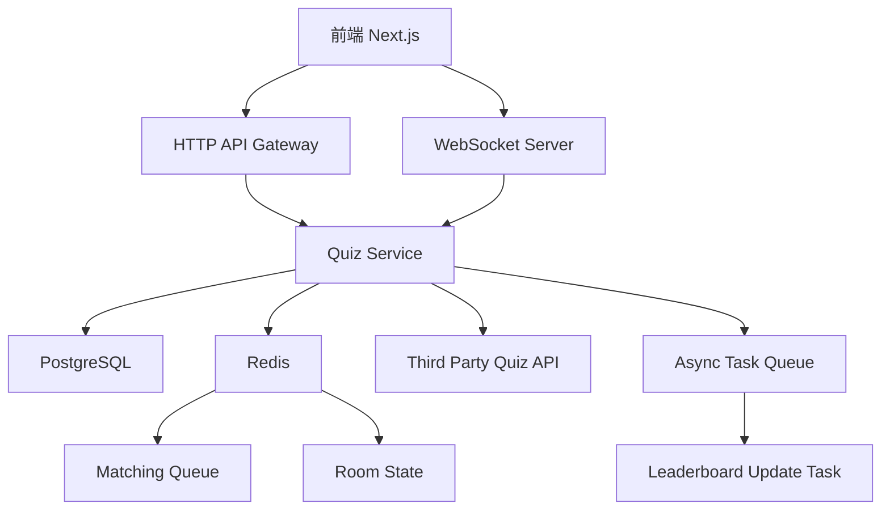
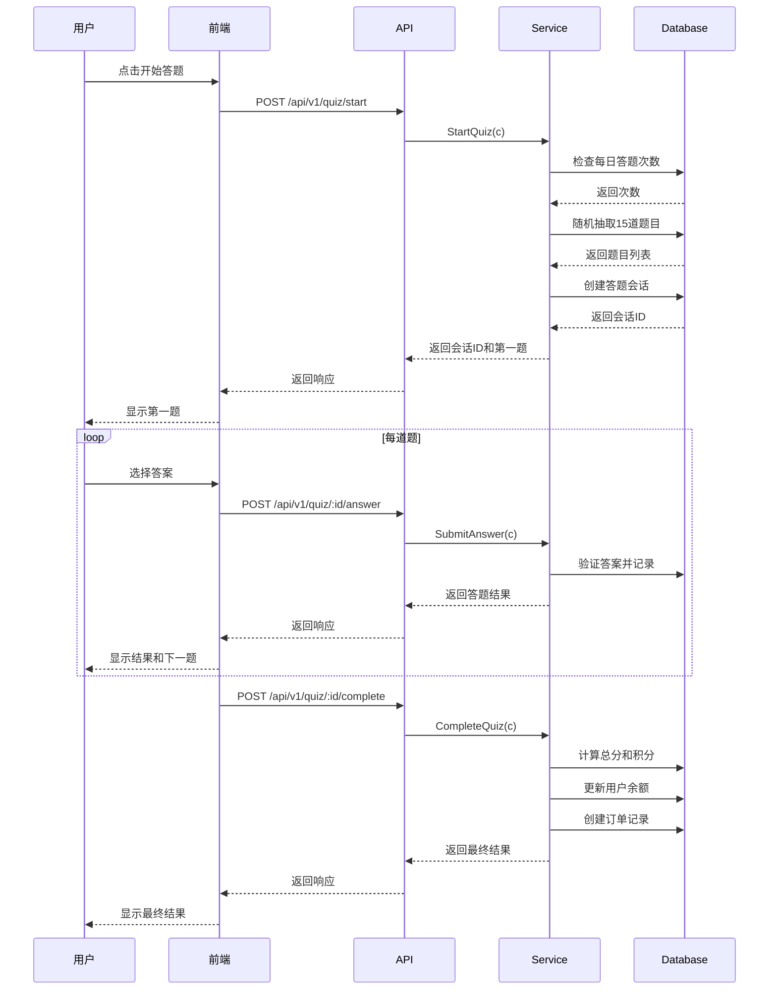
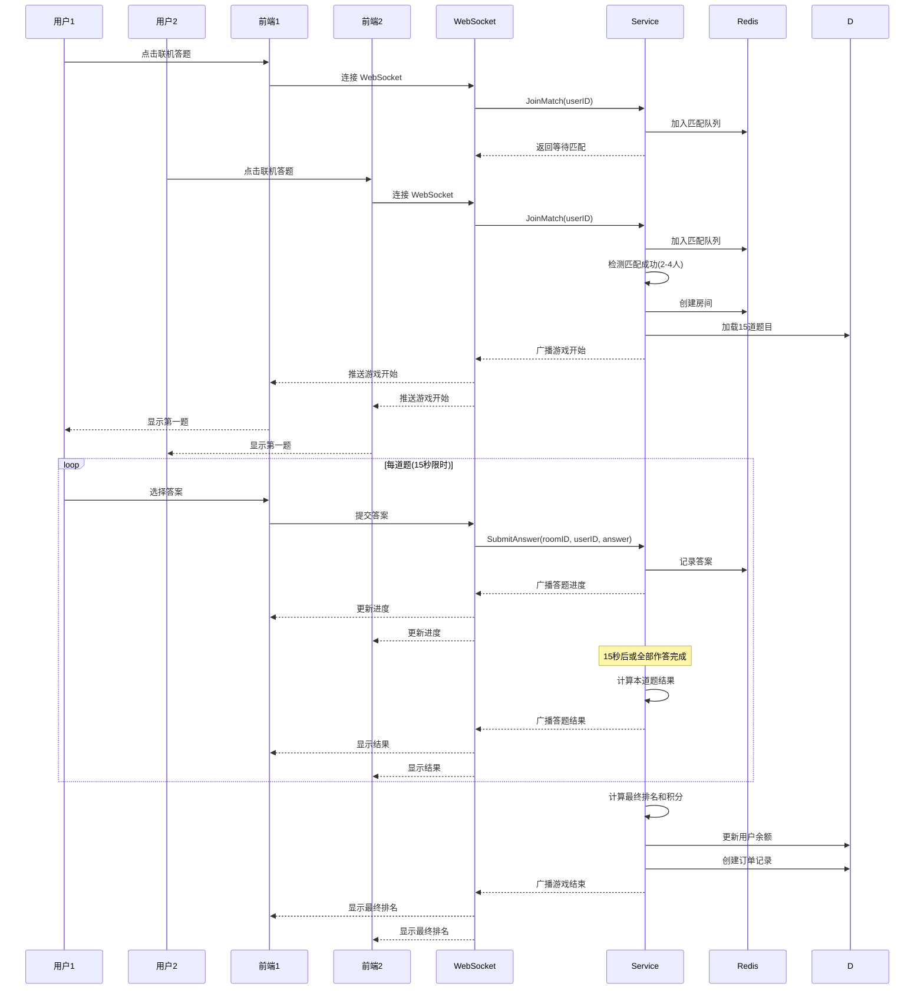

# 红色答题游戏技术设计文档

Feature Name: quiz-game
Updated: 2026-03-20

## 描述

红色答题游戏是一个基于 WebSocket 的实时答题系统，支持单机和联机两种模式。用户可以通过答题赚取积分，系统设有排行榜功能增加竞争性。系统采用 Go + WebSocket + Redis 实现实时匹配和答题同步。

## 架构

### 系统架构图



### 单机答题流程时序图



### 联机答题流程时序图



## 组件和接口

### 后端组件

#### 1. 答题核心模块

**位置**: `internal/apps/quiz/`

**主要文件**:

- `routers.go` - HTTP 路由处理函数
- `logics.go` - 单机答题业务逻辑
- `websocket.go` - WebSocket 连接处理和联机答题逻辑
- `types.go` - 请求/响应类型定义
- `errs.go` - 错误定义
- `constants.go` - 常量定义
- `matcher.go` - 匹配逻辑
- `room.go` - 房间管理

**核心接口**:

```go
// HTTP 接口
func StartQuiz(c *gin.Context)          // 开始答题
func SubmitAnswer(c *gin.Context)       // 提交答案（单机）
func GetQuizSession(c *gin.Context)     // 获取会话详情
func CompleteQuiz(c *gin.Context)       // 完成答题（单机）
func GetHistory(c *gin.Context)         // 获取答题历史
func GetLeaderboard(c *gin.Context)     // 获取排行榜

// WebSocket 接口
func HandleWebSocket(c *gin.Context)    // WebSocket 连接处理
func JoinMatch(userID uint64)           // 加入匹配
func LeaveMatch(userID uint64)          // 离开匹配
func SubmitMultiplayerAnswer(...)       // 提交答案（联机）
```

#### 2. 管理员答题模块

**位置**: `internal/apps/admin/quiz/`

**主要文件**:

- `routers.go` - 路由处理函数
- `types.go` - 请求/响应类型定义
- `errs.go` - 错误定义

**核心接口**:

```go
func CreateQuestion(c *gin.Context)     // 添加题目
func ListQuestions(c *gin.Context)      // 获取题目列表
func UpdateQuestion(c *gin.Context)     // 更新题目
func DeleteQuestion(c *gin.Context)     // 删除题目
func ImportQuestions(c *gin.Context)    // 批量导入题目
func ExportQuestions(c *gin.Context)    // 导出题目
func GetStatistics(c *gin.Context)      // 获取答题统计
func UpdateConfig(c *gin.Context)       // 更新配置
```

#### 3. 数据模型

**位置**: `internal/model/quiz.go`

```go
// QuizQuestion 题目模型
type QuizQuestion struct {
    ID            uint64          `json:"id" gorm:"primaryKey"`
    Type          QuizType        `json:"type" gorm:"type:varchar(20);not null"`
    Content       string          `json:"content" gorm:"type:text;not null"`
    Options       pq.StringArray  `json:"options" gorm:"type:text[]"`
    CorrectAnswer pq.Int64Array   `json:"correct_answer" gorm:"type:bigint[]"`
    Source        QuestionSource  `json:"source" gorm:"type:varchar(20);default:'manual'"`
    ExternalID    *string         `json:"external_id" gorm:"size:100"`
    CreatedBy     *uint64         `json:"created_by"`
    CreatedAt     time.Time       `json:"created_at" gorm:"autoCreateTime"`
    UpdatedAt     time.Time       `json:"updated_at" gorm:"autoUpdateTime"`
    DeletedAt     gorm.DeletedAt  `json:"deleted_at" gorm:"index"`
}

// QuizSession 答题会话模型
type QuizSession struct {
    ID             uint64               `json:"id" gorm:"primaryKey"`
    Mode           QuizMode             `json:"mode" gorm:"type:varchar(20);not null"`
    UserID         uint64               `json:"user_id" gorm:"index;not null"`
    RoomID         *string              `json:"room_id" gorm:"size:64;index"`
    TotalQuestions int                  `json:"total_questions" gorm:"default:15"`
    CorrectCount   int                  `json:"correct_count" gorm:"default:0"`
    TotalScore     int                  `json:"total_score" gorm:"default:0"`
    TotalPoints    decimal.Decimal      `json:"total_points" gorm:"type:numeric(20,2);default:0"`
    Duration       int                  `json:"duration" gorm:"default:0"`
    Status         QuizSessionStatus    `json:"status" gorm:"type:varchar(20);default:'ongoing'"`
    StartedAt      time.Time            `json:"started_at"`
    CompletedAt    *time.Time           `json:"completed_at"`
    
    // 关联字段
    UserDetails    *QuizSessionUser     `json:"user_details" gorm:"-"`
    Details        []QuizSessionDetail  `json:"details" gorm:"-"`
}

// QuizSessionDetail 答题详情模型
type QuizSessionDetail struct {
    ID          uint64          `json:"id" gorm:"primaryKey"`
    SessionID   uint64          `json:"session_id" gorm:"index;not null"`
    QuestionID  uint64          `json:"question_id" gorm:"not null"`
    UserAnswer  pq.Int64Array   `json:"user_answer" gorm:"type:bigint[]"`
    IsCorrect   bool            `json:"is_correct"`
    Score       int             `json:"score" gorm:"default:0"`
    TimeSpent   int             `json:"time_spent" gorm:"default:0"`
    AnsweredAt  time.Time       `json:"answered_at"`
    Question    *QuizQuestion   `json:"question" gorm:"-"`
}

// QuizLeaderboard 排行榜模型
type QuizLeaderboard struct {
    ID            uint64          `json:"id" gorm:"primaryKey"`
    UserID        uint64          `json:"user_id" gorm:"uniqueIndex:idx_period_user;not null"`
    Period        LeaderboardPeriod `json:"period" gorm:"uniqueIndex:idx_period_user;type:varchar(20)"`
    TotalScore    int             `json:"total_score" gorm:"default:0"`
    TotalSessions int             `json:"total_sessions" gorm:"default:0"`
    CorrectRate   decimal.Decimal `json:"correct_rate" gorm:"type:numeric(5,2);default:0"`
    UpdatedAt     time.Time       `json:"updated_at" gorm:"autoUpdateTime"`
    
    // 关联字段
    Username      string          `json:"username" gorm:"-"`
    AvatarURL     string          `json:"avatar_url" gorm:"-"`
}

// QuizType 题型
type QuizType string

const (
    QuizTypeSingleChoice   QuizType = "single_choice"
    QuizTypeMultipleChoice QuizType = "multiple_choice"
    QuizTypeTrueFalse      QuizType = "true_false"
)

// QuizMode 答题模式
type QuizMode string

const (
    QuizModeSingle      QuizMode = "single"
    QuizModeMultiplayer QuizMode = "multiplayer"
)

// QuizSessionStatus 会话状态
type QuizSessionStatus string

const (
    QuizSessionOngoing   QuizSessionStatus = "ongoing"
    QuizSessionCompleted QuizSessionStatus = "completed"
    QuizSessionAbandoned QuizSessionStatus = "abandoned"
)

// QuestionSource 题目来源
type QuestionSource string

const (
    QuestionSourceManual      QuestionSource = "manual"
    QuestionSourceImport      QuestionSource = "import"
    QuestionSourceThirdParty  QuestionSource = "third_party"
)

// LeaderboardPeriod 排行榜周期
type LeaderboardPeriod string

const (
    LeaderboardDaily   LeaderboardPeriod = "daily"
    LeaderboardWeekly  LeaderboardPeriod = "weekly"
    LeaderboardMonthly LeaderboardPeriod = "monthly"
    LeaderboardAllTime LeaderboardPeriod = "all_time"
)
```

### WebSocket 消息协议

**位置**: `internal/apps/quiz/types.go`

```go
// WebSocket 消息类型
type WSMessageType string

const (
    // 客户端 -> 服务器
    WSMsgJoinMatch       WSMessageType = "join_match"
    WSMsgLeaveMatch      WSMessageType = "leave_match"
    WSMsgSubmitAnswer    WSMessageType = "submit_answer"
    
    // 服务器 -> 客户端
    WSMsgWaitingMatch    WSMessageType = "waiting_match"
    WSMsgMatchSuccess    WSMessageType = "match_success"
    WSMsgGameStart       WSMessageType = "game_start"
    WSMsgNextQuestion    WSMessageType = "next_question"
    WSMsgAnswerResult    WSMessageType = "answer_result"
    WSMsgGameEnd         WSMessageType = "game_end"
    WSMsgError           WSMessageType = "error"
)

// WebSocket 消息结构
type WSMessage struct {
    Type      WSMessageType `json:"type"`
    Payload   interface{}   `json:"payload"`
    Timestamp int64         `json:"timestamp"`
}

// 房间状态（存储在 Redis）
type RoomState struct {
    RoomID      string                   `json:"room_id"`
    Players     map[uint64]*PlayerState  `json:"players"`
    Questions   []uint64                 `json:"questions"`
    CurrentQ    int                      `json:"current_question"`
    Status      string                   `json:"status"`
    StartedAt   int64                    `json:"started_at"`
}

// 玩家状态
type PlayerState struct {
    UserID     uint64 `json:"user_id"`
    Username   string `json:"username"`
    Score      int    `json:"score"`
    CorrectNum int    `json:"correct_num"`
    Connected  bool   `json:"connected"`
}
```

### 前端组件

#### 1. 用户端页面

**位置**: `frontend/app/(app)/quiz/`

**页面结构**:

- `page.tsx` - 答题主页（选择模式）
- `single/page.tsx` - 单机答题页面
- `multiplayer/page.tsx` - 联机答题页面
- `history/page.tsx` - 答题历史页面
- `leaderboard/page.tsx` - 排行榜页面

#### 2. 管理员页面

**位置**: `frontend/app/(admin)/admin/quiz/`

**页面结构**:

- `page.tsx` - 答题统计页面
- `questions/page.tsx` - 题目管理页面
- `questions/create/page.tsx` - 添加题目页面
- `questions/import/page.tsx` - 批量导入页面
- `config/page.tsx` - 配置管理页面

#### 3. 前端服务层

**位置**: `frontend/lib/services/quiz/`

**文件结构**:

- `quiz.service.ts` - API 调用封装
- `websocket.service.ts` - WebSocket 连接管理
- `types.ts` - TypeScript 类型定义
- `index.ts` - 导出

**核心服务方法**:

```typescript
class QuizService {
    // 单机答题
    async startQuiz(mode: 'single'): Promise<StartQuizResponse>
    async submitAnswer(sessionId: string, answer: number[]): Promise<AnswerResponse>
    async completeQuiz(sessionId: string): Promise<CompleteQuizResponse>
    async getHistory(page: number, pageSize: number): Promise<HistoryResponse>
    
    // 排行榜
    async getLeaderboard(period: string, page: number): Promise<LeaderboardResponse>
    
    // 管理员
    async createQuestion(data: CreateQuestionRequest): Promise<void>
    async listQuestions(params: ListQuestionsParams): Promise<ListQuestionsResponse>
    async importQuestions(file: File): Promise<ImportResponse>
    async getStatistics(): Promise<StatisticsResponse>
    async updateConfig(data: UpdateConfigRequest): Promise<void>
}

class QuizWebSocket {
    connect(): void
    joinMatch(callback: (msg: WSMessage) => void): void
    submitAnswer(roomId: string, answer: number[]): void
    disconnect(): void
}
```

## 数据模型

### 数据库表结构

#### quiz_questions 表

```sql
CREATE TABLE quiz_questions (
    id BIGINT PRIMARY KEY,
    type VARCHAR(20) NOT NULL,
    content TEXT NOT NULL,
    options TEXT[],
    correct_answer BIGINT[],
    source VARCHAR(20) DEFAULT 'manual',
    external_id VARCHAR(100),
    created_by BIGINT,
    created_at TIMESTAMP DEFAULT CURRENT_TIMESTAMP,
    updated_at TIMESTAMP DEFAULT CURRENT_TIMESTAMP,
    deleted_at TIMESTAMP,
    
    INDEX idx_source (source),
    INDEX idx_deleted_at (deleted_at)
);
```

#### quiz_sessions 表

```sql
CREATE TABLE quiz_sessions (
    id BIGINT PRIMARY KEY,
    mode VARCHAR(20) NOT NULL,
    user_id BIGINT NOT NULL,
    room_id VARCHAR(64),
    total_questions INT DEFAULT 15,
    correct_count INT DEFAULT 0,
    total_score INT DEFAULT 0,
    total_points NUMERIC(20,2) DEFAULT 0,
    duration INT DEFAULT 0,
    status VARCHAR(20) DEFAULT 'ongoing',
    started_at TIMESTAMP NOT NULL,
    completed_at TIMESTAMP,
    
    INDEX idx_user_id (user_id),
    INDEX idx_room_id (room_id),
    INDEX idx_status (status),
    INDEX idx_started_at (started_at)
);
```

#### quiz_session_details 表

```sql
CREATE TABLE quiz_session_details (
    id BIGINT PRIMARY KEY,
    session_id BIGINT NOT NULL,
    question_id BIGINT NOT NULL,
    user_answer BIGINT[],
    is_correct BOOLEAN DEFAULT FALSE,
    score INT DEFAULT 0,
    time_spent INT DEFAULT 0,
    answered_at TIMESTAMP NOT NULL,
    
    INDEX idx_session_id (session_id),
    INDEX idx_question_id (question_id)
);
```

#### quiz_leaderboard 表

```sql
CREATE TABLE quiz_leaderboard (
    id BIGINT PRIMARY KEY,
    user_id BIGINT NOT NULL,
    period VARCHAR(20) NOT NULL,
    total_score INT DEFAULT 0,
    total_sessions INT DEFAULT 0,
    correct_rate NUMERIC(5,2) DEFAULT 0,
    updated_at TIMESTAMP DEFAULT CURRENT_TIMESTAMP,
    
    UNIQUE INDEX idx_period_user (period, user_id),
    INDEX idx_total_score (period, total_score DESC)
);
```

### Redis 数据结构

#### 1. 匹配队列

```
Key: quiz:match:queue
Type: List
Value: userID1, userID2, ...
TTL: 无（持久化）
```

#### 2. 房间状态

```
Key: quiz:room:{roomID}
Type: Hash
Fields: {
    "room_id": "xxx",
    "players": JSON.stringify(players),
    "questions": JSON.stringify(questionIDs),
    "current_question": 0,
    "status": "ongoing",
    "started_at": timestamp
}
TTL: 1小时
```

#### 3. 用户连接映射

```
Key: quiz:user:conn:{userID}
Type: String
Value: connectionID
TTL: 1小时
```

#### 4. 每日答题次数

```
Key: quiz:daily:{userID}:{date}
Type: String
Value: count
TTL: 24小时
```

## 正确性属性

### 数据一致性

1. **答题会话的原子性**: 单机答题完成时，必须在事务中完成：
   - 更新会话状态
   - 计算总积分
   - 更新用户余额
   - 创建订单记录
   - 更新排行榜

2. **联机答题的同步性**: 使用 Redis 房间状态和 WebSocket 广播确保所有玩家看到相同的题目和结果

3. **排行榜更新**: 使用定时任务每小时更新排行榜，避免实时计算的性能问题

### 业务规则

1. **每日答题次数限制**: 
   - 每个用户每日答题次数不超过配置值（默认10次）
   - 使用 Redis 计数器实时记录

2. **积分计算规则**:
   - 基础分：答对得10分
   - 时间奖励：最快答对额外得5分
   - 排名奖励：联机模式第一名加成20%
   - 最终积分 = (基础分 + 时间奖励) × 倍率 + 排名奖励

3. **匹配规则**:
   - 匹配人数：2-4人
   - 匹配超时：30秒未匹配到足够玩家，取消匹配
   - 玩家中途退出：视为放弃，不获得积分

4. **答题时间**:
   - 每题限时15秒
   - 时间到自动提交当前答案（未作答视为答错）

### 性能约束

1. **并发支持**: 至少支持1000个并发答题会话
2. **WebSocket延迟**: 消息推送延迟不超过500ms
3. **匹配速度**: 平均匹配时间不超过10秒

## 错误处理

### 错误码定义

**位置**: `internal/apps/quiz/errs.go`

```go
const (
    ErrDailyLimitExceeded     = "今日答题次数已达上限"
    ErrNoQuestionsAvailable   = "题库中没有可用题目"
    ErrSessionNotFound         = "答题会话不存在"
    ErrSessionAlreadyCompleted = "答题会话已完成"
    ErrMatchTimeout            = "匹配超时"
    ErrRoomNotFound            = "房间不存在"
    ErrNotInRoom               = "您不在该房间中"
    ErrInvalidAnswer           = "答案格式错误"
    ErrQuestionNotFound        = "题目不存在"
    ErrWebSocketConnFailed     = "WebSocket连接失败"
)
```

### 错误处理策略

1. **WebSocket 断线重连**: 前端实现自动重连机制，最多重试3次
2. **匹配失败**: 返回友好提示，建议用户稍后重试或切换单机模式
3. **答题超时**: 自动提交答案，显示超时提示
4. **数据库错误**: 记录详细日志，返回通用错误提示

### 日志记录

- 所有答题操作记录 INFO 级别日志
- WebSocket 连接状态记录 DEBUG 级别日志
- 错误情况记录 ERROR 级别日志
- 日志包含：用户ID、会话ID、房间ID、操作类型、结果

## 测试策略

### 单元测试

**测试范围**:

1. **积分计算**: 验证基础分、时间奖励、排名奖励的计算正确性
2. **匹配逻辑**: 验证匹配队列和房间创建的正确性
3. **答案验证**: 验证单选题、多选题、判断题的答案验证
4. **次数限制**: 验证每日答题次数限制的正确性

**测试文件位置**: `internal/apps/quiz/*_test.go`

### 集成测试

**测试场景**:

1. **完整单机答题流程**: 从开始到完成的端到端测试
2. **联机匹配和答题**: 模拟多个用户匹配和答题
3. **并发答题**: 测试高并发场景下的数据一致性
4. **WebSocket 连接**: 测试连接、断线、重连

**测试文件位置**: `internal/apps/quiz/integration_test.go`

### 性能测试

**测试场景**:

1. **并发单机答题**: 1000个用户同时开始单机答题
2. **WebSocket 并发**: 500个 WebSocket 连接同时发送消息
3. **匹配性能**: 100个用户同时加入匹配队列

**性能指标**:

- 单机答题响应时间: P99 < 200ms
- WebSocket 消息延迟: P99 < 500ms
- 匹配成功率: > 95%

## 第三方题库集成

### 支持的第三方题库

1. **开放题库 API** (示例):
   ```go
   type ThirdPartyQuizAPI interface {
       GetQuestions(count int, category string) ([]QuizQuestion, error)
       GetQuestionByID(id string) (*QuizQuestion, error)
   }
   ```

2. **配置管理**:
   - API Key 和 Endpoint 存储在系统配置表
   - 支持多个第三方题库配置
   - 失败时回退到本地题库

3. **缓存策略**:
   - 从第三方获取的题目缓存到本地数据库
   - 标记 `source = 'third_party'` 和 `external_id`
   - 避免重复获取相同题目

## 部署和迁移

### 数据库迁移

**迁移文件**: `migrations/YYYYMMDDHHMMSS_create_quiz_tables.sql`

```sql
-- 创建 quiz_questions 表
CREATE TABLE quiz_questions (
    -- ... 表结构 ...
);

-- 创建 quiz_sessions 表
CREATE TABLE quiz_sessions (
    -- ... 表结构 ...
);

-- 创建 quiz_session_details 表
CREATE TABLE quiz_session_details (
    -- ... 表结构 ...
);

-- 创建 quiz_leaderboard 表
CREATE TABLE quiz_leaderboard (
    -- ... 表结构 ...
);

-- 添加索引
CREATE INDEX idx_quiz_sessions_user ON quiz_sessions(user_id);
-- ... 其他索引 ...
```

### 配置项

**系统配置** (添加到 `system_configs` 表):

- `quiz_daily_limit`: 每日答题次数上限（默认: 10）
- `quiz_question_count`: 每次答题题目数量（默认: 15）
- `quiz_time_per_question`: 每题时间限制（秒）（默认: 15）
- `quiz_points_multiplier`: 积分倍率（默认: 0.1）
- `quiz_min_players`: 联机模式最小玩家数（默认: 2）
- `quiz_max_players`: 联机模式最大玩家数（默认: 4）
- `quiz_enabled`: 答题功能是否启用（默认: true）
- `quiz_third_party_api_url`: 第三方题库API地址
- `quiz_third_party_api_key`: 第三方题库API密钥

### 定时任务

**任务1**: 更新排行榜

- **任务名称**: `UpdateQuizLeaderboardTask`
- **执行频率**: 每小时执行一次
- **任务逻辑**: 重新计算日榜、周榜、月榜

**任务2**: 清理过期房间

- **任务名称**: `CleanupQuizRoomsTask`
- **执行频率**: 每小时执行一次
- **任务逻辑**: 删除 Redis 中超过1小时的房间状态

### WebSocket 服务器配置

**Gin 路由配置**:

```go
// 在 internal/router/router.go 中添加
quizGroup := r.Group("/api/v1/quiz/ws")
quizGroup.GET("/multiplayer", quiz.HandleWebSocket)
```

**Nginx 配置** (生产环境):

```nginx
location /api/v1/quiz/ws {
    proxy_pass http://backend:8000;
    proxy_http_version 1.1;
    proxy_set_header Upgrade $http_upgrade;
    proxy_set_header Connection "upgrade";
    proxy_set_header Host $host;
    proxy_read_timeout 3600s;
}
```

## 监控和告警

### 监控指标

1. **答题活跃度**: 每日答题次数、参与人数
2. **WebSocket 连接数**: 当前活跃连接数
3. **匹配成功率**: 匹配成功次数 / 匹配尝试次数
4. **答题正确率**: 平均正确率
5. **积分发放**: 每日发放的总积分数

### 告警规则

1. WebSocket 连接数异常（突然下降）
2. 匹配成功率 < 80% 持续 10 分钟
3. 题库题目数量 < 100
4. 第三方题库 API 调用失败率 > 10%

## 安全考虑

### 防作弊措施

1. **答案不可见**: 题目和答案在答题开始后才返回前端
2. **时间限制**: 严格的时间限制防止用户查找答案
3. **答案加密**: WebSocket 消息中的答案数据加密传输
4. **频率限制**: 每日答题次数限制防止刷分

### 权限控制

1. **用户认证**: 所有答题接口需要验证 OAuth2 登录状态
2. **管理员权限**: 题目管理和配置管理需要管理员权限

### 数据安全

1. **SQL 注入防护**: 使用 GORM 参数化查询
2. **XSS 防护**: 前端使用 React 自动转义
3. **WebSocket 安全**: 验证 WebSocket 连接的认证 token

## 参考资料

[^1]: (internal/apps/redenvelope/routers.go) - 红包功能实现参考
[^2]: (internal/model/users.go) - 用户模型和余额更新参考
[^3]: (internal/service/payment.go) - 余额更新服务参考
[^4]: (gorilla/websocket) - WebSocket 库文档
[^5]: (go-redis/redis) - Redis 客户端文档
